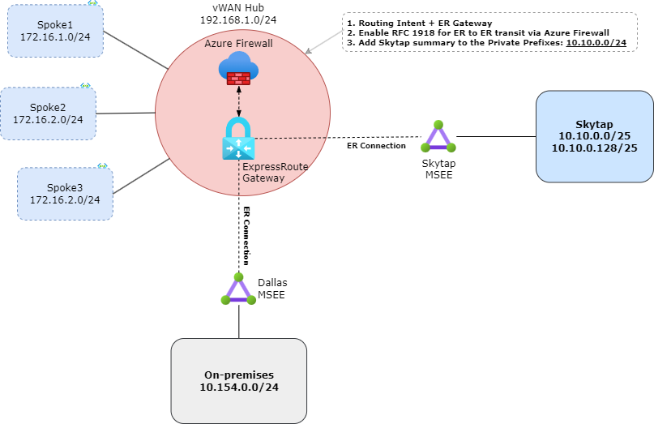

# Skytap transit with Virtual WAN Routing Intent

Skytap Lab using Virtual WAN Routing Intent for ER to ER transit

#### Use cases

- ExpressRoute Local SKU.
- Lack of Global Reach feature.
- Traffic inspection between Skytap and On-premises is required.

#### Considerations

- You must open a support ticket to enable ER to ER transit using Azure Virtual WAN + Routing Intent. See: [Transit connectivity between ExpressRoute circuits with routing intent](https://learn.microsoft.com/en-us/azure/virtual-wan/how-to-routing-policies#expressroute).
- Add a Skytap summary prefix (example 10.10.0.0/24) inside the Private traffic prefixes.
    - You must add that prefix using Azure Firewall Manager - Security Configuration -  Private traffic prefixes as shown:
    
- Review carefully all the considerations when enabling routing policies/intent by reviewing [Virtual WAN Hub routing intent and routing policies - Troubleshooting data path](https://learn.microsoft.com/en-us/azure/virtual-wan/how-to-routing-policies#troubleshooting). Especially RFC 1918 prefixes (10.0.0.0/8, 172.16.0.0/12, 192.168.0.0/16) which are advertised by default from Secured-vHUB. If the On-premises ExpressRoute circuit already advertises those prefixes, routing adjustments must be made before enabling Routing-Intent.
- In case customer is already advertising RFC 1918, before enable Routing Intent is important to break them in two halves (more specific) on the customer side to ensure they can keep attracting private traffic from Azure to their on-premises network. Here is how that breakdown should be: 10.0.0.0/9, 10.128.0.0/9, 172.16.0.0/13, 172.24.0.0/13, 192.168.0.0/17, 192.168.128.0/17.